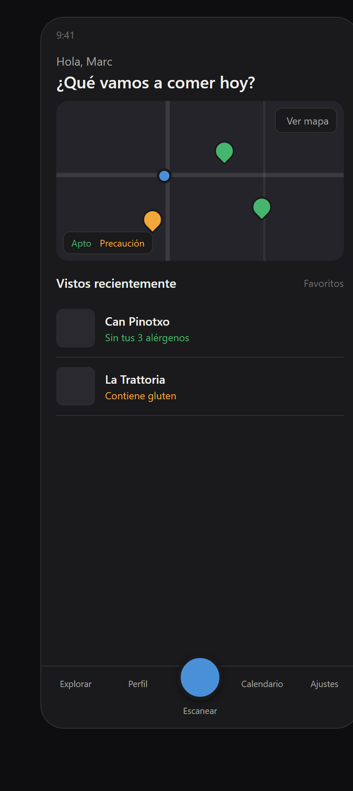
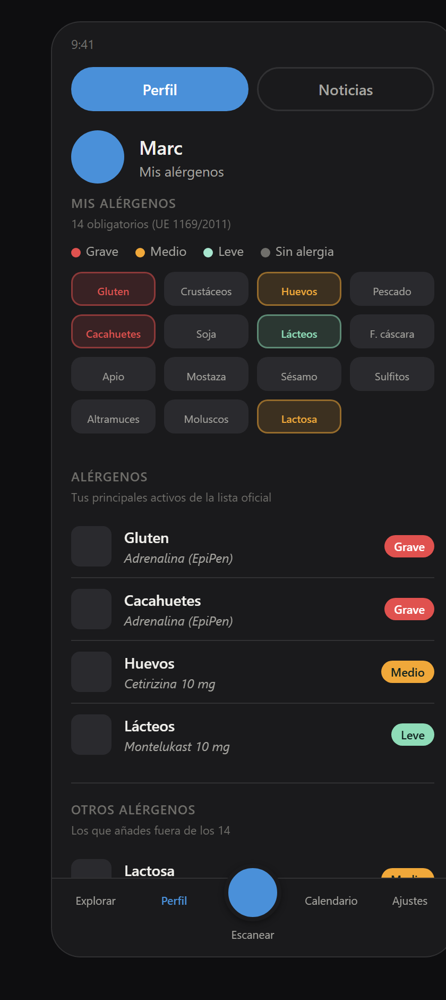
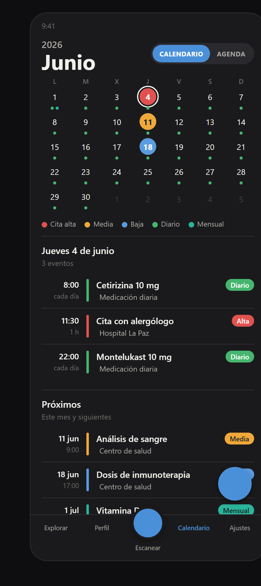
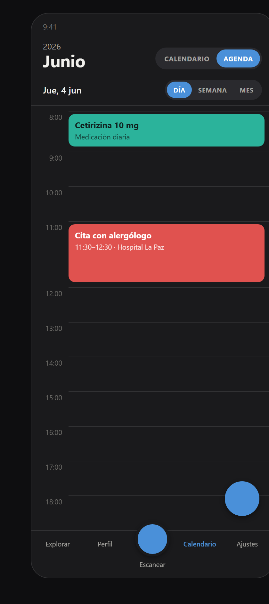

# AllergINC (nombre provisional)

App móvil (Android + iOS) que avisa a personas con alergias e intolerancias
alimentarias de la presencia de sus alérgenos en menús de restaurantes.

## Estado

Fase de diseño, en **tema oscuro**. Sin código de aplicación todavía. Tres
pantallas aprobadas (Inicio, Perfil y Calendario); sus maquetas HTML están en
`disenos/`. Ver `docs/ESTADO-PROYECTO.md` para el detalle.

Pendiente para la próxima sesión: rediseñar **Inicio** y concretar la pantalla de
**Noticias**.

## Pantallas (estado actual)

> Capturas en `disenos/capturas/`. Abre los `.html` de `disenos/` en el navegador
> para ver los iconos (la fuente se carga por CDN y no aparece en las capturas).

| Inicio | Perfil |
|---|---|
|  |  |

| Calendario (rejilla) | Calendario (agenda) |
|---|---|
|  |  |

## Cómo retomar el trabajo con Claude sin gastar tokens de más

El archivo **`CLAUDE.md`** (raíz del repositorio) resume todo el estado y las
decisiones. En Claude Code se lee de forma automática. En la app web de Claude,
añádelo al "Conocimiento del proyecto" para que Claude lo lea sin releer el
historial completo.

## Estructura

```
.
├── CLAUDE.md                  Contexto central (leer primero)
├── README.md
├── docs/
│   ├── ESTADO-PROYECTO.md     Estado y decisiones
│   └── superpowers/specs/     Especificaciones de diseño
├── disenos/                   Maquetas HTML (+ capturas/ con las imágenes)
└── .claude/
    ├── commands/              Comandos: /inicio /cierre /pantalla /revisa
    ├── agents/                Agente: revisor-rn
    └── scripts/               Hooks de sesión
```

## Pila tecnológica (tentativa)

React Native + Expo · Cloudflare D1 · API de IA para escaneo (por decidir).
