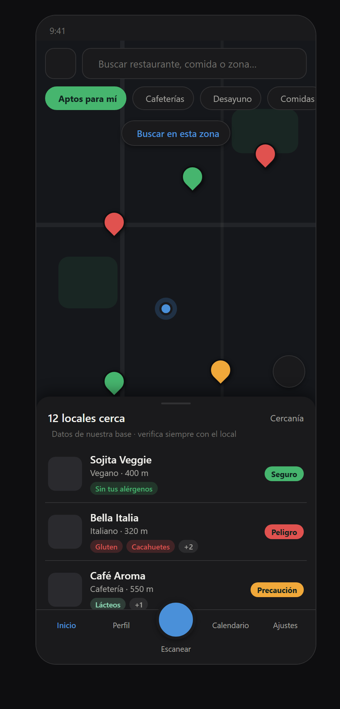
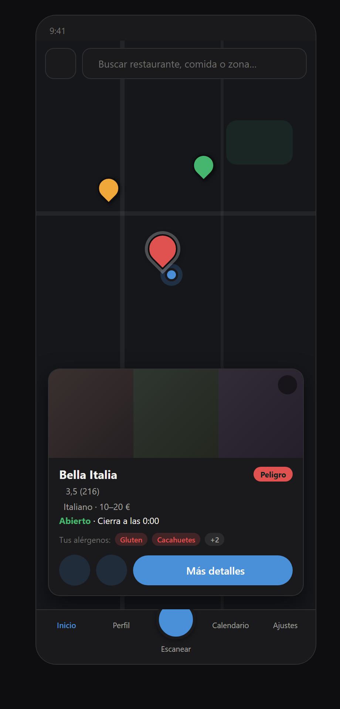
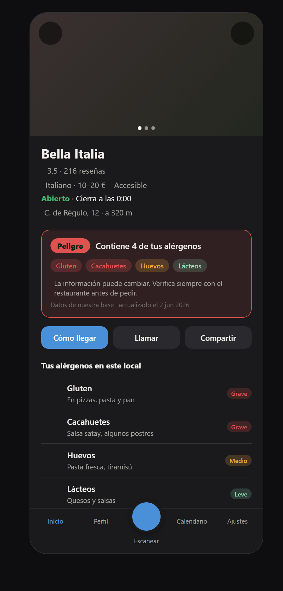
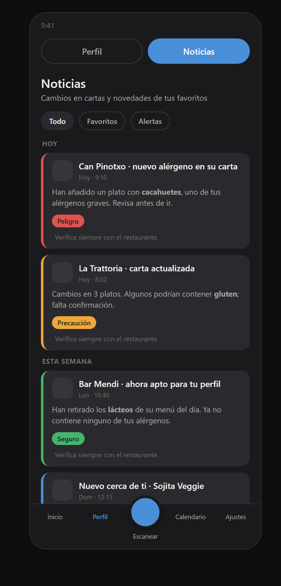

<div align="center">

# AllergINC

**Aplicación móvil que ayuda a personas con alergias e intolerancias alimentarias a comer fuera con seguridad.**

Muestra, para cada restaurante y plato, qué alérgenos del perfil del usuario están presentes, con un veredicto de compatibilidad claro y un recordatorio constante de verificar con el local.

</div>

---

## Para quién es

- **Personas con alergias o intolerancias alimentarias** que comen fuera de casa y necesitan saber, de un vistazo, si un local es compatible con su perfil.
- **Familias y cuidadores** de personas alérgicas (en especial menores), que gestionan varios perfiles y la medicación asociada.
- **Personas con reacciones graves (riesgo de anafilaxia)**, para quienes la rapidez y la fiabilidad de la información son críticas.

**Alcance inicial:** los **14 alérgenos de declaración obligatoria** del Reglamento (UE) 1169/2011, información que los restaurantes están legalmente obligados a facilitar. Esto centra el producto en el mercado europeo y resuelve parcialmente el problema de origen de los datos. Las intolerancias no reguladas y la lista completa de ingredientes quedan para fases posteriores.

## Qué hace

| Subsistema | Función | Estado |
|---|---|---|
| A | Perfil del usuario: alérgenos con gravedad y medicación asociada | Diseñado |
| B | Calendario de medicación y citas médicas a largo plazo | Diseñado |
| C | Repositorio propio de locales y cartas, explorable en mapa | Interfaz diseñada · datos pendientes |
| D | Escaneo de cartas con IA (cámara, OCR y comparación con el perfil) | Pendiente |

## Estado del proyecto

Fase de **diseño**, con interfaz en **tema oscuro**. Todas las pantallas son maquetas (prototipos HTML autocontenidos en [`disenos/`](disenos/)); aún no hay código de aplicación ni plan de implementación.

Pantallas aprobadas: Inicio, Explorar (mapa, emergente y ficha de local), Perfil, Calendario (rejilla y agenda) y Noticias.

## Pantallas

|  |  |  |  |
|:---:|:---:|:---:|:---:|
| **Inicio** · descubrimiento | **Explorar** · mapa | **Explorar** · emergente | **Ficha** de local |

|  |  |  |  |
|:---:|:---:|:---:|:---:|
| **Perfil** · alérgenos | **Noticias** | **Calendario** · rejilla | **Calendario** · agenda |

_Las capturas no muestran los iconos (se cargan por CDN). Abre los archivos de `disenos/` en el navegador para verlas completas._

## Seguridad y fiabilidad

Una aplicación de alérgenos que da información incorrecta es un riesgo de seguridad (anafilaxia). Por eso cada decisión de diseño prioriza la fiabilidad:

- **Veredicto de compatibilidad** uniforme en mapa, listas y fichas: **Seguro** (verde), **Precaución** (naranja), **Peligro** (rojo) y **Sin información** (gris).
- **La ausencia de datos nunca equivale a "seguro".** Un local sin información se marca en gris, jamás en verde.
- Aviso permanente de **"verifica con el restaurante"** y marca de **fecha de actualización** del dato.

## Pila tecnológica (tentativa)

- **Aplicación:** React Native + Expo (Android e iOS).
- **Datos:** Cloudflare D1 como repositorio propio de locales, cartas y alérgenos.
- **Mapa:** react-native-maps (Google Maps / MapLibre), pintando los locales del repositorio propio en lugar de Google Places para evitar coste por petición y poder mostrar datos de alérgenos.
- **Acciones nativas:** abrir rutas en Maps, llamar (`tel:`) y compartir mediante la hoja del sistema.
- **IA de escaneo (D):** proveedor de OCR y análisis por decidir, con evaluación de coste por uso.

## Estructura del repositorio

```
.
├── CLAUDE.md                 Contexto del proyecto (referencia principal)
├── README.md
├── HANDOVER.md               Estado vivo entre sesiones
├── docs/
│   ├── ESTADO-PROYECTO.md    Estado detallado y decisiones
│   └── superpowers/specs/    Especificaciones de diseño
├── disenos/                  Maquetas HTML
│   └── capturas/             Imágenes de las pantallas
└── .claude/
    ├── commands/             Comandos: /inicio /cierre /pantalla /revisa
    ├── agents/               Agente: revisor-rn
    └── scripts/              Hooks de sesión
```

## Cómo está organizado el trabajo

El proyecto avanza por sesiones. `CLAUDE.md` resume el estado y las decisiones; en la app web de Claude conviene añadirlo al "Conocimiento del proyecto" para retomar sin releer el historial. `HANDOVER.md` recoge el punto exacto donde se dejó cada sesión.

## Aviso legal

Proyecto en desarrollo, sin garantías. La información de alérgenos podrá proceder de terceros y puede contener errores u omisiones; **no sustituye la confirmación directa con el establecimiento**. El usuario es responsable de verificar la idoneidad de cada plato para su caso.
